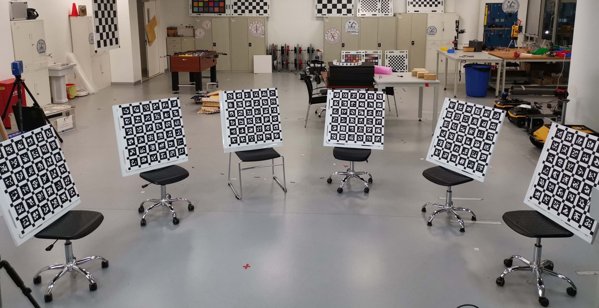

# Multical

**Mul**tiple **t**argets for multiple **I**MUs, **c**ameras **a**nd **L**iDARs (Lasers) spatiotemporal calibration
## The dataset is available [here](https://robotics.shanghaitech.edu.cn/datasets/multical)
## Introduction
Multical is a calibration toolbox to simultaneously calibrate the spatial and temporal 
parameters between multiple IMUs, cameras and
LiDARs(laser range finders). Nowadays, camera, LiDAR and Inertial Measurement Unit (IMU) are widely used in mobile robots and
autonomous cars, and they are usually equipped with two and more cameras and LiDARs to increase fields of view (FoVs)
as large as possible.
The calibration of these sensors becomes much more cumbersome with existing methods and toolboxes, mainly for two reasons:
a) Due to the size limitation, one calibration target usually cannot cover all sensors.
It is hard to calibrate all sensors simultaneously, if some sensors do not overlap with each others.
b) There are methods providing LiDAR-camera, LiDAR-IMU and camera-IMU calibration, but very few approaches (if any)
can jointly calibrate multiple IMUs, cameras and LiDARs, rather than in pairs.
Therefore, an approach which can calibrate multiple cameras, LiDARs and IMUs simultaneously will facilitate the robotics
community.

To this end, we utilize multiple calibration targets to cover the FoVs of
all sensors at the same time in this toolbox.
Comparing to existing calibration libraries, the core features of Multical are
1. utilizing non-repeated April tags to distinguish multiple planar boards as 
   calibration targets. Moreover, the mount and position of targets are not limited,
   which are decided by the users according to the FOV of sensors to be calibrated.
   The following figure shows an example layout of calibration scenario, 
   which consists of six apriltag boards.  
   
1. Multical is very flexible regarding types and mount of sensors. 
   Besides one mandatory camera, the users can add IMUs, LiDARs and more cameras
   according to their demands, _i.e._, not only IMUs-cameras-LiDARs but
   reduced calibration problems, like
   IMUs-cameras, cameras-LiDARs even multi-camera calibration are all supported. 
1. Multical has a series of algorithms to estimate prior knowledge of the extrinsic parameters,
   so it does not force the users to give any initial guesses,
   including the relative poses of apriltag boards.

**Please find more information on the [wiki pages](https://github.com/zhixy/multical/wiki) of this repository.**

This library is developed based on [Kalibr](https://github.com/ethz-asl/kalibr),
we reserve all the features, functions and tools of Kalibr in this library.
By reusing and extending the codes of Kalibr, we develop Multical. 

## Reference
The relative paper has been published at IROS2022, see the [pre-print](https://github.com/zhixy/multical/blob/master/doc/multical.pdf). Please consider cite our paper if you are using this tool:
```
@conference {332,
	title = {Multical: Spatiotemporal Calibration for Multiple IMUs, Cameras and LiDARs},
	booktitle = {IEEE/RSJ International Conference on Intelligent Robots and Systems (IROS)},
	year = {In Press},
	publisher = {IEEE Press},
	organization = {IEEE Press},
	author = {Zhi, Xiangyang and Hou, Jiawei and Lu, Yiren and Kneip, Laurent and Schwertfeger, S{\"o}ren}
}
```

## License (BSD)

BSD 3-Clause License

Copyright (c) 2021, Xiangyang Zhi
All rights reserved.

Redistribution and use in source and binary forms, with or without
modification, are permitted provided that the following conditions are met:

1. Redistributions of source code must retain the above copyright notice, this
   list of conditions and the following disclaimer.

2. Redistributions in binary form must reproduce the above copyright notice,
   this list of conditions and the following disclaimer in the documentation
   and/or other materials provided with the distribution.

3. Neither the name of the copyright holder nor the names of its
   contributors may be used to endorse or promote products derived from
   this software without specific prior written permission.

THIS SOFTWARE IS PROVIDED BY THE COPYRIGHT HOLDERS AND CONTRIBUTORS "AS IS"
AND ANY EXPRESS OR IMPLIED WARRANTIES, INCLUDING, BUT NOT LIMITED TO, THE
IMPLIED WARRANTIES OF MERCHANTABILITY AND FITNESS FOR A PARTICULAR PURPOSE ARE
DISCLAIMED. IN NO EVENT SHALL THE COPYRIGHT HOLDER OR CONTRIBUTORS BE LIABLE
FOR ANY DIRECT, INDIRECT, INCIDENTAL, SPECIAL, EXEMPLARY, OR CONSEQUENTIAL
DAMAGES (INCLUDING, BUT NOT LIMITED TO, PROCUREMENT OF SUBSTITUTE GOODS OR
SERVICES; LOSS OF USE, DATA, OR PROFITS; OR BUSINESS INTERRUPTION) HOWEVER
CAUSED AND ON ANY THEORY OF LIABILITY, WHETHER IN CONTRACT, STRICT LIABILITY,
OR TORT (INCLUDING NEGLIGENCE OR OTHERWISE) ARISING IN ANY WAY OUT OF THE USE
OF THIS SOFTWARE, EVEN IF ADVISED OF THE POSSIBILITY OF SUCH DAMAGE.

We heavily reuse the code of Kalibr, 
and the following lines are about the license of Kalibr.

Copyright (c) 2014, Paul Furgale, Jérôme Maye and Jörn Rehder, Autonomous Systems Lab, ETH Zurich, Switzerland<br>
Copyright (c) 2014, Thomas Schneider, Skybotix AG, Switzerland<br>
All rights reserved.<br>

Redistribution and use in source and binary forms, with or without modification, are permitted provided that the following conditions are met:

1. Redistributions of source code must retain the above copyright notice, this list of conditions and the following disclaimer.

1. Redistributions in binary form must reproduce the above copyright notice, this list of conditions and the following disclaimer in the documentation and/or other materials provided with the distribution.

1. All advertising materials mentioning features or use of this software must display the following acknowledgement: This product includes software developed by the Autonomous Systems Lab and Skybotix AG.

1. Neither the name of the Autonomous Systems Lab and Skybotix AG nor the names of its contributors may be used to endorse or promote products derived from this software without specific prior written permission.

THIS SOFTWARE IS PROVIDED BY THE AUTONOMOUS SYSTEMS LAB AND SKYBOTIX AG ''AS IS'' AND ANY EXPRESS OR IMPLIED WARRANTIES, INCLUDING, BUT NOT LIMITED TO, THE IMPLIED WARRANTIES OF MERCHANTABILITY AND FITNESS FOR A PARTICULAR PURPOSE ARE DISCLAIMED. IN NO EVENT SHALL the AUTONOMOUS SYSTEMS LAB OR SKYBOTIX AG BE LIABLE FOR ANY DIRECT, INDIRECT, INCIDENTAL, SPECIAL, EXEMPLARY, OR CONSEQUENTIAL DAMAGES (INCLUDING, BUT NOT LIMITED TO, PROCUREMENT OF SUBSTITUTE GOODS OR SERVICES; LOSS OF USE, DATA, OR PROFITS; OR BUSINESS INTERRUPTION) HOWEVER CAUSED AND ON ANY THEORY OF LIABILITY, WHETHER IN CONTRACT, STRICT LIABILITY, OR TORT (INCLUDING NEGLIGENCE OR OTHERWISE) ARISING IN ANY WAY OUT OF THE USE OF THIS SOFTWARE, EVEN IF ADVISED OF THE POSSIBILITY OF SUCH DAMAGE.
